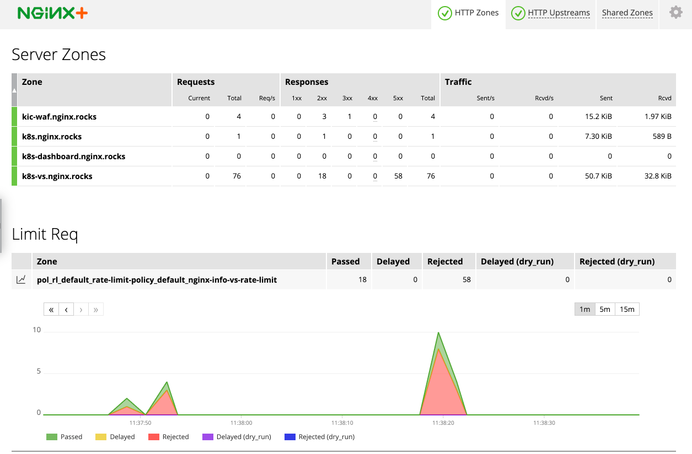
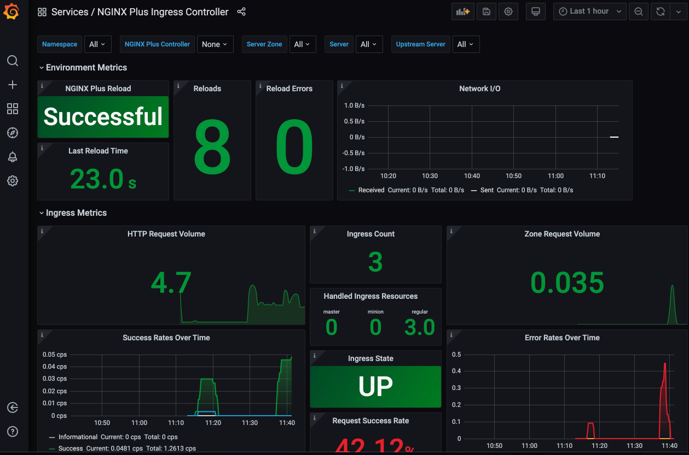

# NGINX Plus Ingress Demo

Single node kubernetes cluster with nginx ingress on hostnetwork with automatic /etc/hosts managment for easy demos.

The scripts overwrite all settings without warning. Use on a new VM only.

Recomend 2 vCPU / 3 gb mem

Demo includes:

* NGINX App Protect for Kubernetes Ingress

* Prometheus / Grafana preconfigured with [NGINX's provided sample](https://github.com/nginxinc/kubernetes-ingress/tree/master/grafana)

* NGINX built-in monitoring dashboard

Adapted from <https://www.redpill-linpro.com/techblog/2019/04/04/kubernetes-setup.html>

## General Requirements

1. This was built on a base ubuntu 18.04 build. YMMV with other distros.

1. You must build your NGINX Plus ingress container, this demo includes NGINX App Protect, follow these instructions: <https://docs.nginx.com/nginx-ingress-controller/app-protect/installation/>

1. That process will push your container image to your private registry. You need to edit [7.plus-ingress-install.sh](7.plus-ingress-install.sh) with one of the auth methods to authenticate to your registry.

1. You will also need to copy the NSM images to nginx-service-mesh

1. If not using vagrant, just run `sh 1.run-all-scripts.sh` do not run as sudo.

1. If not using vagrant, you'll need to modify your hosts file and add these hosts to it, pointing to your VM: cafe.example.com k8s.nginx.rocks k8s-dashboard.nginx.rocks k8s-vs.nginx.rocks kic-waf.nginx.rocks

1. If not using vagrant, you can skip everything below this line.

## Steps if using vagrant (you need to run all steps except 4. and 5.)

# This currently is not working, just use the method above for now

8. Vagrant (brew install vagrant)

1. The default provider in this example is Virtualbox. Modify the Vagrantfile to your needs.

1. <https://github.com/devopsgroup-io/vagrant-hostmanager> ```vagrant plugin install vagrant-hostmanager```

1. `vagrant up` takes about 5 minutes.

1. Once up, `vagrant ssh` and run `k get pods -A` to make sure everything is running (not creating). Note that kubectl is aliased to k and bash/zsh autocomplete is enabled.

1. A [bookmark file](bookmarks.html) can be imported into chrome with the links to each resource.

## Troubleshooting

If you run into issues, here are a few commands that you may find useful:

```
docker ps -a # look for exiting containers
# bash into and modify config directly:
docker exec -it --user=0 --privileged k8s_plus-nap-kic-nginx-ingress-***** apt update
docker exec -it --user=0 --privileged k8s_plus-nap-kic-nginx-ingress-***** apt -y install curl vim
docker exec -it --user=0 --privileged k8s_plus-nap-kic-nginx-ingress-***** bash
kubectl -n nginx-mesh port-forward svc/grafana --address=0.0.0.0 3000:3000 &
kubectl -n nginx-mesh port-forward svc/prometheus --address 0.0.0.0 9090 &
kubectl -n nginx-mesh port-forward svc/zipkin --address 0.0.0.0 9411 &
kubectl port-forward svc/productpage --address=0.0.0.0 9080:9080 &
Open the tracing server URL in a browser. For example, you might access the Zipkin server at http://localhost:9411/zipkin/.
nginx-meshctl services #list services

```

Pics:

NGINX Plus Dashboard for KIC


Grafana Dashboard

